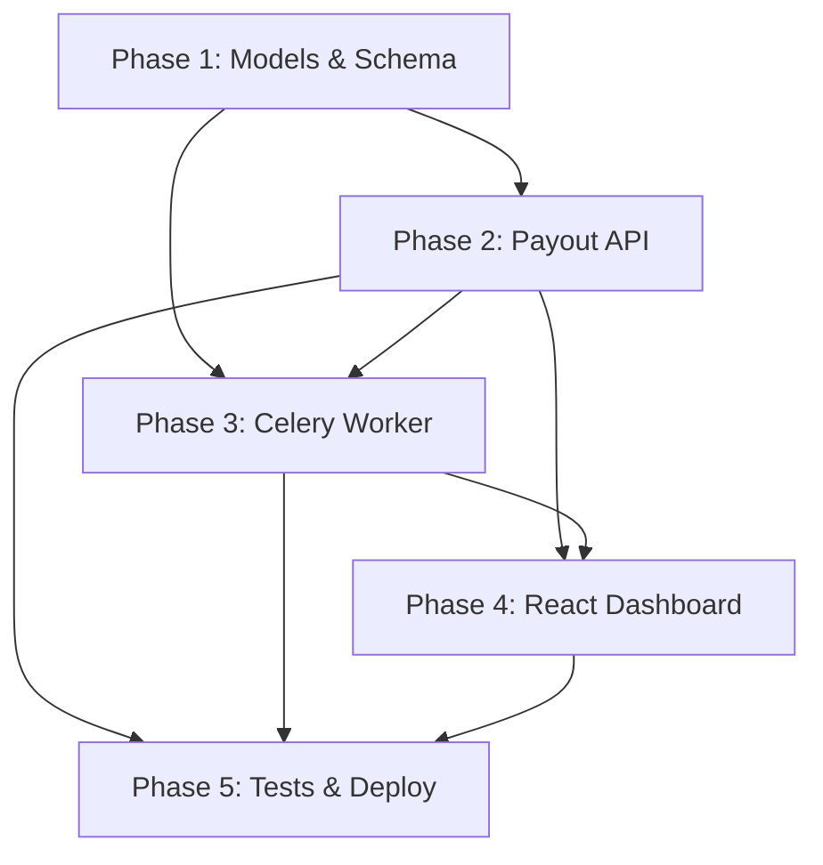

# Playto Payout Engine — Implementation Plan

> **Goal:** Build a production-grade payout engine (Django+DRF backend, React+Tailwind frontend, PostgreSQL, Celery worker) that passes all grading criteria: money integrity, concurrency, idempotency, state machine correctness, and retry logic.

---

## Phase 1 — Project Scaffolding & Data Models *(~2 hrs)*

> **Phase Outcome:** A running Django+React project with a correct, auditable ledger schema. Everything downstream depends on getting this right.

### Task 1.1 — Backend Scaffold

| # | Subtask | Gain | Integration Note |
|---|---------|------|-----------------|
| 1.1.1 | `django-admin startproject payto_engine .` + create `payouts` app | Establishes project namespace | All future apps import from here |
| 1.1.2 | Install deps: `djangorestframework`, `psycopg2-binary`, `celery`, `redis`, `django-cors-headers` | Locks tech stack per spec | Celery broker = Redis |
| 1.1.3 | Configure `settings.py`: PostgreSQL, Celery broker, CORS, DRF defaults, `TIME_ZONE='Asia/Kolkata'` | Single source of config | Frontend will hit CORS-allowed origin |
| 1.1.4 | Create `docker-compose.yml` with `postgres:16` + `redis:7` services | One-command dev environment (bonus deliverable) | Same compose used in deployment |

> [!IMPORTANT]
> **Manual Test 1.1:** Run `docker-compose up`, then `python manage.py check`. Confirm 0 errors. This validates DB connectivity + Celery broker before any code.

---

### Task 1.2 — Ledger & Merchant Models

| # | Subtask | Gain | Integration Note |
|---|---------|------|-----------------|
| 1.2.1 | Create `Merchant` model: `id (UUID PK)`, `name`, `email`, `created_at` | Identity for all ledger entries | FK target for every transaction |
| 1.2.2 | Create `BankAccount` model: `id`, `merchant (FK)`, `account_number`, `ifsc`, `is_primary` | Required by payout request body | Validated on payout creation |
| 1.2.3 | Create `LedgerEntry` model: `id`, `merchant (FK)`, `entry_type (CREDIT/DEBIT/HOLD/RELEASE)`, `amount_paise (BigIntegerField)`, `description`, `reference_id`, `created_at` | **Core invariant**: balance = SUM(credits) − SUM(debits+holds) + SUM(releases). No mutable balance field — derived only. | Every payout creates HOLD entry; completion creates DEBIT; failure creates RELEASE |
| 1.2.4 | Create `Payout` model: `id (UUID)`, `merchant (FK)`, `bank_account (FK)`, `amount_paise (BigIntegerField)`, `status` (enum: PENDING/PROCESSING/COMPLETED/FAILED), `idempotency_key`, `attempts`, `created_at`, `updated_at`, `processed_at` | Tracks lifecycle; `status` is the state machine | Celery worker reads PENDING payouts |
| 1.2.5 | Create `IdempotencyRecord` model: `id`, `merchant (FK)`, `key (UUID)`, `response_data (JSONField)`, `created_at` | Stores first response for replay | Queried before payout creation |
| 1.2.6 | Add DB constraints: `unique_together = (merchant, idempotency_key)` on `IdempotencyRecord`, check constraint `amount_paise > 0` | DB-level safety net | Prevents duplicates even under race |
| 1.2.7 | Write balance calculation as a **model manager method** using `django.db.models.Sum` + `Case/When` — pure SQL aggregation | **Grading criterion**: no Python arithmetic on fetched rows | Used by API, dashboard, and concurrency guard |

> [!CAUTION]
> **Critical Design Decision:** Balance is NEVER stored as a column. It is always `SELECT SUM(CASE WHEN type='CREDIT' THEN amount WHEN type='DEBIT' THEN -amount WHEN type='HOLD' THEN -amount WHEN type='RELEASE' THEN amount END) FROM ledger WHERE merchant_id=X`. This is the single most important invariant.

> [!IMPORTANT]
> **Manual Test 1.2:** Open Django shell. Create a merchant, add 2 credit entries. Call `Merchant.objects.get_balance(merchant_id)`. Verify it matches manual sum. Then add a HOLD entry and verify balance decreases.

---

### Task 1.3 — Seed Script

| # | Subtask | Gain | Integration Note |
|---|---------|------|-----------------|
| 1.3.1 | Create `management/commands/seed_data.py` — creates 3 merchants, each with 2-3 bank accounts and 5-10 credit entries (varying amounts) | Deliverable requirement + demo data | Used by deployment, reviewers, and tests |
| 1.3.2 | Make script idempotent (check before create) | Safe to run multiple times | CI/CD friendly |

---

## Phase 2 — Core Payout API with Concurrency & Idempotency *(~3 hrs)*

> **Phase Outcome:** A battle-tested `POST /api/v1/payouts` endpoint that handles double-submit, race conditions, and idempotency correctly. This is 60% of the grade.

### Task 2.1 — Payout Serializer & View

| # | Subtask | Gain | Integration Note |
|---|---------|------|-----------------|
| 2.1.1 | Create `PayoutSerializer`: validates `amount_paise` (positive BigInt), `bank_account_id` (must belong to merchant) | Input validation layer | Rejects garbage before touching DB |
| 2.1.2 | Create `PayoutViewSet` with `create` action at `POST /api/v1/payouts` | REST endpoint per spec | Frontend form submits here |
| 2.1.3 | Extract `Idempotency-Key` from request header; return 400 if missing | Enforces idempotency contract | Every payout request must have this |

---

### Task 2.2 — Idempotency Logic

| # | Subtask | Gain | Integration Note |
|---|---------|------|-----------------|
| 2.2.1 | On request: query `IdempotencyRecord` for `(merchant, key)`. If exists AND not expired (< 24hrs): return stored `response_data` with same status code. | **Grading criterion**: exact same response on replay | Prevents duplicate payouts |
| 2.2.2 | If key exists but expired (> 24hrs): delete old record, treat as new request | Spec: keys expire after 24 hours | Prevents stale key conflicts |
| 2.2.3 | If in-flight (record exists but `response_data` is NULL): return `409 Conflict` | Handles "first request still processing when second arrives" | EXPLAINER.md question #3 |
| 2.2.4 | After successful payout creation: save response JSON to `IdempotencyRecord.response_data` | Completes the idempotency loop | Must be in same transaction |

> [!WARNING]
> **Race condition on idempotency insert:** Two simultaneous requests with the same key could both see "no record" and both try to insert. Solution: Use `INSERT ... ON CONFLICT DO NOTHING` via `get_or_create` inside a transaction, then check if we were the creator.

---

### Task 2.3 — Concurrency-Safe Balance Check & Hold *(MOST CRITICAL TASK)*

| # | Subtask | Gain | Integration Note |
|---|---------|------|-----------------|
| 2.3.1 | Wrap entire payout creation in `transaction.atomic()` | All-or-nothing DB operation | Covers balance check + hold + payout record |
| 2.3.2 | Inside transaction: `SELECT ... FOR UPDATE` on merchant's ledger entries (or use `select_for_update()` on the merchant row) | **Grading criterion**: DB-level lock prevents race | Two 60₹ payouts on 100₹ balance → exactly one succeeds |
| 2.3.3 | Compute available balance using the SQL aggregation (Task 1.2.7) **inside the lock** | Balance is computed after acquiring exclusive lock | No stale read possible |
| 2.3.4 | If `amount_paise > available_balance`: return `400 Insufficient funds` | Clean rejection | No partial state left behind |
| 2.3.5 | If sufficient: create `LedgerEntry(type=HOLD)` + create `Payout(status=PENDING)` + create `IdempotencyRecord` — all in same transaction | Atomic fund reservation | Balance immediately reflects hold |
| 2.3.6 | Return payout details (id, status, amount, created_at) as response | Consistent API response | Same response stored in idempotency record |

> [!CAUTION]
> **This is where most candidates fail.** The lock MUST be acquired BEFORE the balance check. If you check balance, then lock, then deduct — another request can read the same balance in between. The pattern is: LOCK → READ → DECIDE → WRITE → UNLOCK (implicit via transaction end).

> [!IMPORTANT]
> **Manual Test 2.3:** Using `curl` or Postman, fire two simultaneous payout requests (same merchant, each for 60% of balance) using a tool like `xargs -P2` or two terminal tabs. Verify: exactly one returns 201, exactly one returns 400. Check DB: one HOLD entry, balance reduced by exactly one payout amount.

---

### Task 2.4 — Merchant API Endpoints

| # | Subtask | Gain | Integration Note |
|---|---------|------|-----------------|
| 2.4.1 | `GET /api/v1/merchants/{id}/balance` — returns `available_paise`, `held_paise`, `total_paise` | Dashboard data source | Frontend polls this |
| 2.4.2 | `GET /api/v1/merchants/{id}/ledger` — paginated ledger entries | Transaction history for dashboard | Shows credits, debits, holds |
| 2.4.3 | `GET /api/v1/merchants/{id}/payouts` — paginated payout history with status | Payout table for dashboard | Live status updates |

---

## Phase 3 — Background Worker & State Machine *(~2.5 hrs)*

> **Phase Outcome:** Payouts automatically move through their lifecycle. Failed payouts atomically return funds. Stuck payouts retry with backoff.

### Task 3.1 — Celery Setup

| # | Subtask | Gain | Integration Note |
|---|---------|------|-----------------|
| 3.1.1 | Create `celery.py` in project root with autodiscover | Celery app configured | Workers can be started with `celery -A payto_engine worker` |
| 3.1.2 | Configure Celery Beat schedule: run payout processor every 10 seconds | Periodic task picks up pending payouts | Simulates real bank polling |
| 3.1.3 | Add `docker-compose` service for celery worker + beat | Full stack in one command | Same compose for dev and deploy |

---

### Task 3.2 — Payout Processor Task

| # | Subtask | Gain | Integration Note |
|---|---------|------|-----------------|
| 3.2.1 | Query: `Payout.objects.filter(status=PENDING)` → transition to `PROCESSING` inside `atomic()` + `select_for_update()` | Prevents two workers picking same payout | Scales to multiple workers safely |
| 3.2.2 | Simulate bank API: `random()` → 70% success, 20% fail, 10% hang (sleep + no state change) | Matches spec exactly | Hang case triggers retry logic |
| 3.2.3 | On **success**: inside `atomic()`: set `status=COMPLETED`, create `LedgerEntry(type=DEBIT)` to finalize, remove HOLD entry (or create offsetting RELEASE + DEBIT) | Funds permanently deducted | Balance invariant maintained |
| 3.2.4 | On **failure**: inside `atomic()`: set `status=FAILED`, create `LedgerEntry(type=RELEASE)` to return held funds | Funds returned atomically with state change | **Grading criterion**: atomic refund |
| 3.2.5 | On **hang**: do nothing (leave in PROCESSING) — retry logic (Task 3.3) handles this | Simulates real-world timeout | Processing payouts are candidates for retry |

> [!IMPORTANT]
> **Manual Test 3.2:** Create a payout via API. Watch Celery logs. Verify payout transitions to COMPLETED or FAILED within ~30 seconds. Check ledger entries were created. Verify `SUM(credits) - SUM(debits) - SUM(holds) + SUM(releases) == displayed balance`.

---

### Task 3.3 — State Machine Enforcement

| # | Subtask | Gain | Integration Note |
|---|---------|------|-----------------|
| 3.3.1 | Define `VALID_TRANSITIONS` dict: `{PENDING: [PROCESSING], PROCESSING: [COMPLETED, FAILED]}` | Single source of truth for legal transitions | Used by processor and any future code |
| 3.3.2 | Create `Payout.transition_to(new_status)` method that checks `VALID_TRANSITIONS[current_status]` and raises `InvalidStateTransition` if illegal | **Grading criterion**: backwards transitions blocked | EXPLAINER.md question #4 |
| 3.3.3 | All state changes go through `transition_to()` — never direct `payout.status = X` | Enforcement is inescapable | Code review will verify this |

---

### Task 3.4 — Retry Logic for Stuck Payouts

| # | Subtask | Gain | Integration Note |
|---|---------|------|-----------------|
| 3.4.1 | Separate Celery task (or part of processor): query payouts where `status=PROCESSING` AND `updated_at < now() - 30s` | Finds stuck payouts per spec | Runs on same beat schedule |
| 3.4.2 | Increment `attempts` counter. If `attempts < 3`: reset to PROCESSING, re-simulate bank | Exponential backoff: delay = `2^attempts * base` | Max 3 retries before giving up |
| 3.4.3 | If `attempts >= 3`: transition to FAILED, release funds atomically | Funds not held forever | Same atomic pattern as Task 3.2.4 |

> [!IMPORTANT]
> **Manual Test 3.4:** Temporarily force the bank simulator to always "hang". Create a payout. Wait ~2 minutes. Verify: 3 retry attempts logged, then payout marked FAILED, funds returned to balance.

---

## Phase 4 — React Dashboard *(~2.5 hrs)*

> **Phase Outcome:** A functional merchant dashboard showing balances, ledger, payout form, and payout history with live status. Not pixel-perfect — functional and clean.

### Task 4.1 — React Project Setup

| # | Subtask | Gain | Integration Note |
|---|---------|------|-----------------|
| 4.1.1 | `npx create-react-app frontend` (or Vite) + install Tailwind CSS | Frontend scaffold per spec | Served separately in dev, can be built for production |
| 4.1.2 | Configure API base URL via env variable, set up axios instance with interceptors | Centralized API config | Easy switch between dev/prod URLs |
| 4.1.3 | Create basic layout: sidebar (merchant selector), main content area | Navigation structure | Supports multi-merchant demo |

---

### Task 4.2 — Balance & Ledger Display

| # | Subtask | Gain | Integration Note |
|---|---------|------|-----------------|
| 4.2.1 | Balance card component: shows `Available`, `Held`, `Total` in formatted ₹ amounts (paise → rupees display) | Primary dashboard info | Polls `GET /balance` every 5s for live updates |
| 4.2.2 | Ledger table component: columns = Date, Type, Amount, Description, Reference | Transaction history | Paginated via API, color-coded by type |
| 4.2.3 | Auto-refresh via `setInterval` or React Query `refetchInterval` | Live status updates per spec | Shows balance changes in near-real-time |

---

### Task 4.3 — Payout Request Form

| # | Subtask | Gain | Integration Note |
|---|---------|------|-----------------|
| 4.3.1 | Form fields: Amount (₹, converted to paise on submit), Bank Account (dropdown from merchant's accounts) | Payout creation UI | Submits to `POST /api/v1/payouts` |
| 4.3.2 | Generate UUID `Idempotency-Key` on form render; regenerate on successful submit | Client-side idempotency key generation | Sent as header; prevents double-click |
| 4.3.3 | Show success/error toast on response | User feedback | Displays "Insufficient funds" on 400 |
| 4.3.4 | Disable submit button while request in-flight | Prevents accidental double-submit | UX best practice |

---

### Task 4.4 — Payout History Table

| # | Subtask | Gain | Integration Note |
|---|---------|------|-----------------|
| 4.4.1 | Table: columns = Date, Amount, Bank Account, Status (with color badges), Attempts | Payout tracking | Polls `GET /payouts` for live status |
| 4.4.2 | Status badges: PENDING=yellow, PROCESSING=blue, COMPLETED=green, FAILED=red | Visual status tracking | Updates automatically as worker processes |

> [!IMPORTANT]
> **Manual Test 4.4:** Open dashboard. Submit a payout. Watch the payout appear in table as PENDING → PROCESSING → COMPLETED/FAILED without refreshing the page.

---

## Phase 5 — Testing, Deployment & EXPLAINER.md *(~3 hrs)*

> **Phase Outcome:** Two critical tests pass, app is deployed live, EXPLAINER.md demonstrates deep understanding.

### Task 5.1 — Concurrency Test

| # | Subtask | Gain | Integration Note |
|---|---------|------|-----------------|
| 5.1.1 | Test: Create merchant with 10000 paise balance. Use `threading` to fire 2 simultaneous payout requests for 6000 paise each. | **Deliverable requirement** | Proves DB locking works |
| 5.1.2 | Assert: exactly 1 payout created, exactly 1 rejected, balance == 4000 paise (or 10000 if both rejected, which is also safe) | Validates the invariant | Fails if race condition exists |
| 5.1.3 | Run with `--parallel` flag and TransactionTestCase | Uses real transactions, not test savepoints | Django's TestCase wraps in transaction which hides concurrency bugs |

> [!WARNING]
> **Must use `TransactionTestCase`**, not `TestCase`. Django's default TestCase wraps each test in a transaction, which serializes concurrent requests and hides the exact bug we're testing for.

---

### Task 5.2 — Idempotency Test

| # | Subtask | Gain | Integration Note |
|---|---------|------|-----------------|
| 5.2.1 | Test: Submit payout with `Idempotency-Key: X`. Record response. Submit again with same key. | **Deliverable requirement** | Proves replay works |
| 5.2.2 | Assert: both responses identical (same payout ID, same status, same amount). Only 1 payout in DB. Only 1 HOLD ledger entry. | Validates idempotency contract | Key part of EXPLAINER.md |

---

### Task 5.3 — Additional Validation Tests

| # | Subtask | Gain | Integration Note |
|---|---------|------|-----------------|
| 5.3.1 | Test state machine: attempt `COMPLETED → PENDING` transition, assert raises error | Validates state machine enforcement | EXPLAINER.md question #4 |
| 5.3.2 | Test balance integrity: create merchant, add credits, create payouts (some complete, some fail), verify `balance == SUM(credits) - SUM(debits)` | Validates ledger invariant | The invariant they explicitly check |

---

### Task 5.4 — Deployment

| # | Subtask | Gain | Integration Note |
|---|---------|------|-----------------|
| 5.4.1 | Choose Railway or Render (free tier, supports Django + PostgreSQL + Redis + worker) | **Deliverable requirement** | Must be live for submission |
| 5.4.2 | Create `Procfile` / `railway.json`: web process + worker process | Platform deployment config | Separates web from Celery worker |
| 5.4.3 | Set env vars: `DATABASE_URL`, `REDIS_URL`, `SECRET_KEY`, `ALLOWED_HOSTS`, `CORS_ALLOWED_ORIGINS` | Production config | Different from dev settings |
| 5.4.4 | Run seed script on deployed instance | Test data for reviewers | Reviewers will immediately test the live app |
| 5.4.5 | Build & deploy React frontend (Vercel or same platform) | **Deliverable requirement** | Points to deployed backend |

> [!IMPORTANT]
> **Manual Test 5.4:** Visit deployed URL. Verify dashboard loads, shows seeded merchants, balance displays correctly. Submit a payout. Verify it processes. Run the concurrency curl test against the live URL.

---

### Task 5.5 — EXPLAINER.md

| # | Subtask | Gain | Integration Note |
|---|---------|------|-----------------|
| 5.5.1 | **The Ledger:** Paste the `get_balance()` SQL query. Explain credit/debit/hold/release model and why derived-only balance is correct. | Directly answers grading question #1 | Shows you think in accounting terms |
| 5.5.2 | **The Lock:** Paste the `select_for_update()` + `atomic()` code block. Explain: "PostgreSQL row-level exclusive lock; held until transaction commits; second transaction blocks until first releases." | Directly answers grading question #2 | Shows DB-level vs Python-level understanding |
| 5.5.3 | **The Idempotency:** Explain the lookup → create-or-return flow. Address in-flight case (409 Conflict). Mention `unique_together` constraint as safety net. | Directly answers grading question #3 | Shows network-aware API design |
| 5.5.4 | **The State Machine:** Paste `VALID_TRANSITIONS` dict and `transition_to()` method. Show that `FAILED → COMPLETED` is not in the dict, so it raises. | Directly answers grading question #4 | Simple, auditable, correct |
| 5.5.5 | **The AI Audit:** Document a real instance where AI generated incorrect code (e.g., computing balance in Python instead of SQL, or using `TestCase` instead of `TransactionTestCase` for concurrency test). Show before/after. | Directly answers grading question #5 | Demonstrates engineering maturity |

---

### Task 5.6 — README.md & Final Polish

| # | Subtask | Gain | Integration Note |
|---|---------|------|-----------------|
| 5.6.1 | Write README with: project overview, setup instructions (docker-compose up), API docs, test commands, deployed URL | **Deliverable requirement** | First thing reviewers read |
| 5.6.2 | Clean commit history: squash WIP commits, ensure meaningful messages | Shows professional workflow | "Clean commit history" is in the spec |
| 5.6.3 | Final review: run all tests, verify deployed instance, re-read EXPLAINER.md | Catch last-minute issues | Submit with confidence |

---

## Time Budget Summary

| Phase | Estimated Time | Weight in Grading |
|-------|---------------|-------------------|
| Phase 1: Scaffolding & Models | 2 hrs | Foundation — 15% |
| Phase 2: Payout API (Concurrency + Idempotency) | 3 hrs | **Core — 40%** |
| Phase 3: Background Worker & State Machine | 2.5 hrs | **Core — 25%** |
| Phase 4: React Dashboard | 2.5 hrs | Functional — 10% |
| Phase 5: Tests, Deploy, EXPLAINER | 3 hrs | Polish — 10% |
| **Total** | **~13 hrs** | Within 10-15 hr spec |

---

## Critical Path & Dependencies

## Risk Mitigation

| Risk | Mitigation |
|------|-----------|
| Concurrency test passes locally but fails on deployment | Use `TransactionTestCase`, test against real PostgreSQL (not SQLite) |
| Balance drift over time | Never store balance as column; always derive from ledger SUM |
| Celery worker silently fails | Add logging at every state transition; monitor in deployment logs |
| Idempotency race on key insert | `unique_together` DB constraint + `get_or_create` in transaction |
| Deployment platform issues | Have backup: Railway primary, Render fallback |
